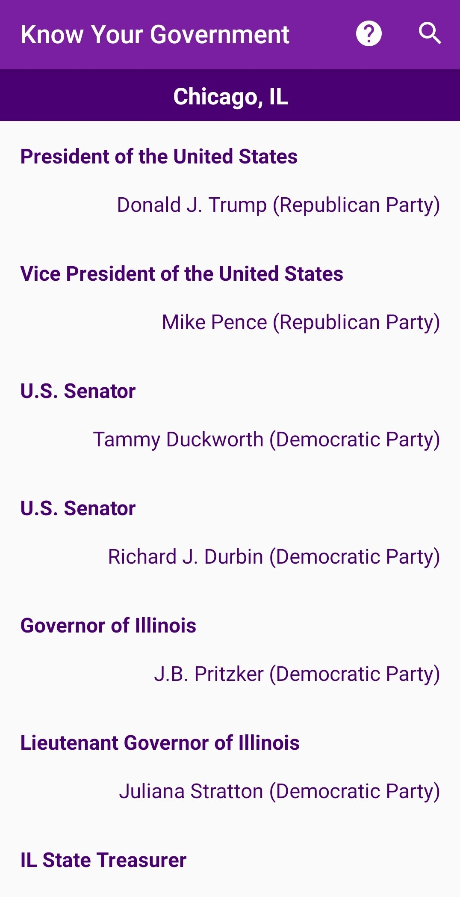

# Know Your Government App
This app displays an interactive list of political officials that represent the current location at aech level of government. The user can enter anther location and get a list of officials for that location instead. The official details include their name, their office, their party, phone, email, website and social media channels. All the links are interactable. Officials from the Democratic party have a blue background whereas officials from the Republican party have a red background. Neopartisan officials have a black background. This application is developed using Android Studio.

Fetches data from [Google Civic Information API](https://developers.google.com/civic-information/)

### Steps to run
1. Get an API key by following the instructions at this [link](https://developers.google.com/civic-information/docs/using_api)
2. In [CivicInformationRunnable.java](./app/src/main/java/com/example/knowyourgovernment/CivicInformationRunnable.java#L23) replace `YOUR_API_KEY` with your API key.
3. Run the project through Android Studio.

Created by [Mayank Phadke](https://mayank-phadke.github.io/)

---
## Screenshots

